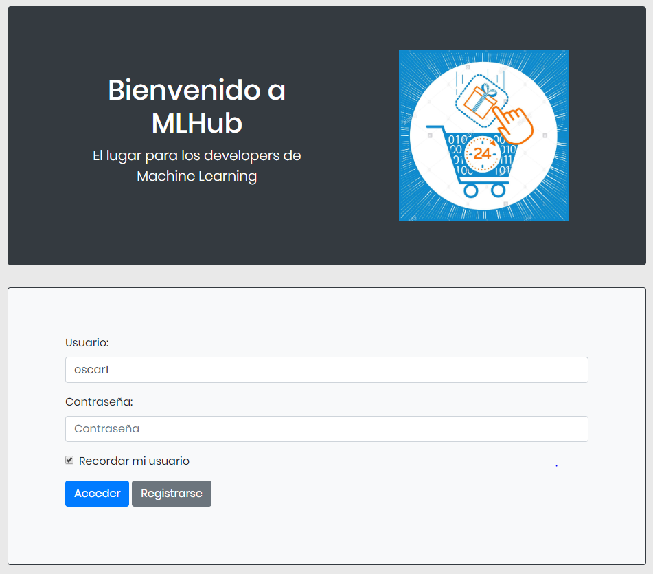
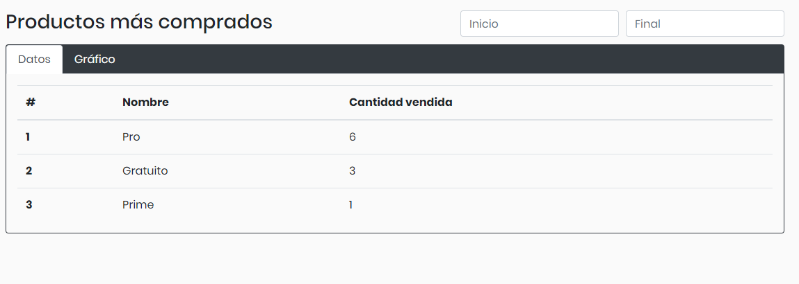
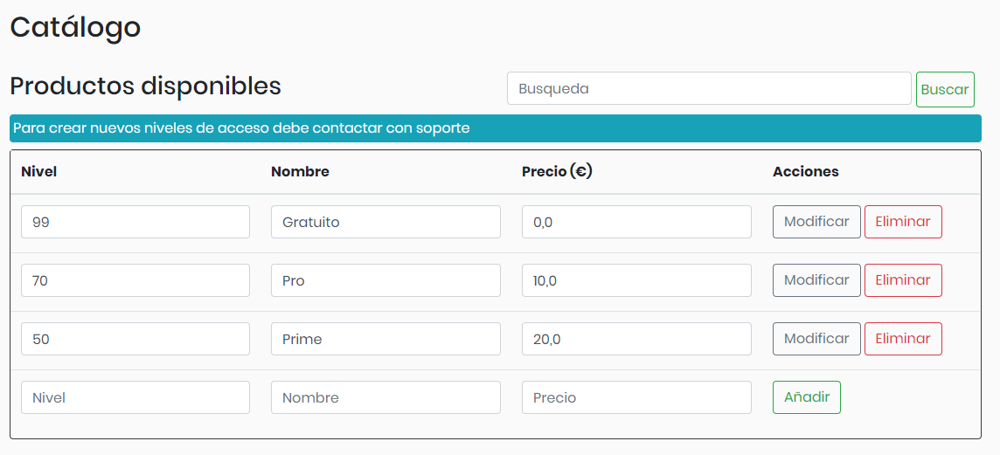

# Introducción

MLHub es una aplicación en la que puede subir su código de Machine Learning y resultados sobre los mismos para compartirlos con la comunidad. Existen diversas suscripciones, cada una dando beneficios. La "Gratuita" permite subir el código, la “Pro” permite subir el código y resultados, y la “Prime” da acceso a toda la funcionalidad, permitiendo además ver los resultados de otras personas. 

# Funciones

Todas las páginas principales disponen de una navegación donde se puede ir directamente a ciertos apartados o buscar una entrada específica. En el lateral izquierdo se dispone de otra navegación en la que se puede desplazar rápidamente por la página web. Ambas funciones se contraen cuando el tamaño de ventana es menor, teniendo sus respectivos botones para volverlas a expandir.

También hay que destacar que se puede acceder directamente a la sección deseada por medio de la url adecuada siempre y cuando se tengan los permisos necesarios, para lo cual es necesario haber iniciado sesión. En el caso de intentar acceder sin haber iniciado sesión, se reenviará al usuario a la página de acceso. Esto es así ya que esta aplicación está diseñada para que los usuarios registrados puedan guardar su código o ver resultados de otros proyectos.

## Acceso y registro ("/MLHub")

En este primer apartado se muestra una pestaña en la que el usuario puede elegir entre acceder con un usuario ya existente o registrarse con un nuevo:

A continuación, mostramos la pantalla en la que creamos un nuevo usuario:

Como se observa anteriormente, la página se compone de tres botones que nos proporcionan las funcionalidades de registrarnos, borrar el formulario o cancelar el nuevo registro y volver a la página de inicio. Es importante señalar que hay campos obligatorios y que no nos dejará completar el proceso sin rellenar dichos campos.

Además, no podremos registrarnos con un nombre de usuario ya existente en nuestra página:

## Inicio ("/MLHub/inicio")

La siguiente página que se mostrará será la de inicio. Encontramos dos vistas diferentes, dependiendo de si la cuenta con la que hemos ingresado es una cuenta de usuario o es una cuenta de administrador. Los dos tipos se explican a continuación.

## Cuenta de usuario

Para el registro con una cuenta de usuario será importante registrarse con un usuario que tenga todos los permisos, es decir, que sea Prime. Para ello, utilizaremos la siguiente cuenta:

* Usuario: oscar1

* Contraseña: pepe

En la pantalla de inicio se nos muestran todos los proyectos existentes además de un menú en el podemos elegir entre diferentes tipos de acciones

Es importante señalar que, además que en la parte inferior de la pantalla encontramos la posibilidad de añadir un nuevo proyecto:

Por otra parte, el buscador de la parte superior nos permite filtrar, enseñándonos solamente los proyectos que tienen en su nombre la combinación de letras que hayamos introducido. Si filtramos por "ti":

## Cuenta de administrador ("/MLHub/inicio/admin")

Esta página está diseñada para el administrador, por lo que solo él puede acceder a ella.

Se divide en dos secciones. En la primera sección, "Estadísticas", el administrador podrá visualizar los productos más comprados y el volumen de compras diario. Ambas opciones podrán observarse en forma de tabla o de gráfica. Los productos más comprados están ordenados de mayor número de ventas a menor, mientras que el volumen de compras diario está ordenado por fecha. Además, ambas partes disponen de selectores para indicar entre que fechas se quiere realizar la búsqueda.

La segunda sección es la de "Productos". En ella se puede visualizar, insertar, eliminar y modificar el listado de productos y ofertas. Además, se puede realizar una búsqueda de un producto específico. Cabe destacar que para los “niveles de acceso” son valores ya definidos por la funcionalidad de la aplicación, por lo que no se pueden modificar. Se muestra un mensaje el cual nos indica si un campo ha sido modificado sin confirmarse el cambio o si ocurre un error al intentar realizar un cambio.

Todos los cambios de esta las búsquedas, modificaciones, inserciones y eliminaciones se realizan mediante AJAX, por lo que los cambios se realizarán de forma asíncrona, mejorando la experiencia de usuario. Además, la página cambia la distribución de los elementos según el tamaño de la ventana.

## Página de subscripciones ("/MLHub/inicio/subscripciones")

En esta página el usuario podrá suscribirse a la opción que desee entre las disponibles. En el caso de intentar subscribirse al mismo producto del que ya dispone o de ser un administrador, mostrará un error y no realizará la acción. Además, se muestran los precios antes y después de las ofertas disponibles.

## Página de historial ("/MLHub /inicio/historial")

En la página del historial se nos muestran las subscripciones que hemos contratado a lo largo del tiempo:

## Página de Usuario ("/MLHub /inicio/modificar/view")

Si pinchamos en la pestaña de usuario se nos muestra un formulario en el que podemos modificar nuestros propios datos:

## Página de Proyecto ("/MLHub /inicio/proyecto")

Esta página varía en función del tipo de suscripción que tengamos. Se accede pulsando en el enlace a cada proyecto que encontraremos en la página de proyectos. El elemento que siempre se nos mostrará, siempre que el proyecto sea nuestro, será la ventana en la que podemos alojar nuestro código:

Como se observa anteriormente, se ha tenido en cuenta que el usuario puede desear introducir código html, sin que esto provoque ningún error en el código mostrado.

Por otra parte, si tenemos una suscripción Pro o Prime, también podremos ver los resultados de nuestros proyectos y añadir nuevos resultados:

Por último, si tenemos una suscripción Prime también podremos ver los resultados de proyectos ajenos, aunque claro está sin añadir nuevos resultados de métodos:

